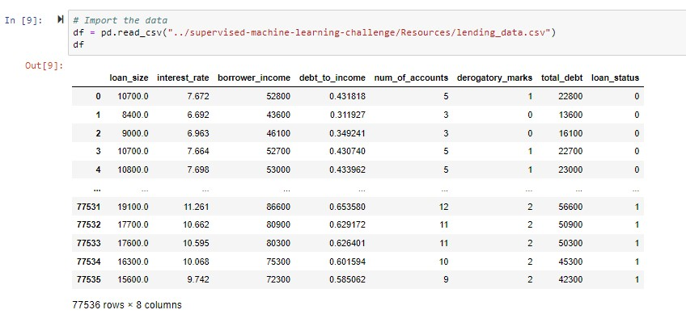

# Module 19 Challenge
## Supervised Machine Learning

# Background
Lending services companies allow individual investors to partially fund personal loans as well as buy and sell notes backing the loans on a secondary market.

You will be using this data to create machine learning models to classify the risk level of given loans. Specifically, you will be comparing the Logistic Regression model and Random Forest Classifier.

## Retrieve the Data
Confirmation of successful upload


## Predict Model Performance
My prediction is that the Random Forests Classifier will perform better because all the features in the dataset appear to be significant when it comes to evaluating the riskiness of a loan. So the individual trees will probably be able to point towards a loan being risky or not

## Split Data into Training/Testing
* remove loan status column
* create y by using the loan status column
* split data

```python
# Define the X (features) and y (target) sets
y = df["loan_status"].values
X = df.drop("loan_status", axis=1)

# Split the data into X_train, X_test, y_train, y_test
from sklearn.model_selection import train_test_split

X_train, X_test, y_train, y_test = train_test_split(X, y, random_state=1)
```

## Create, Fit and Compare Models
* Logistive Regression Model and score

```python
Training Data Score: 0.9921240885954051
Testing Data Score: 0.9918489475856377
```
* Random Forest Classifier Model and score

```python
Training Score: 0.9975409272252029
Testing Score: 0.9915910028889806
```
* Which model performed better?

The Logistic Regression model perfomed just slightly better than the Random Forrest Classifier. Though my predicion was not correct, the scores of both models were very high, and very very close, so someone should be able to confidently choose eith model to classify the risk level of a given loan.
